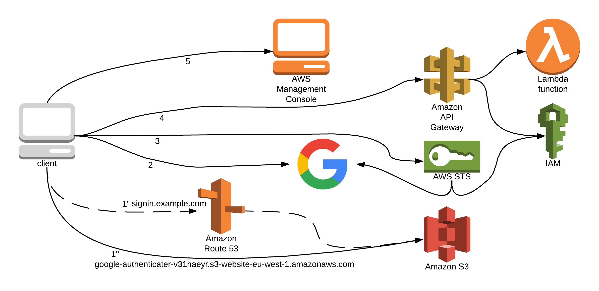
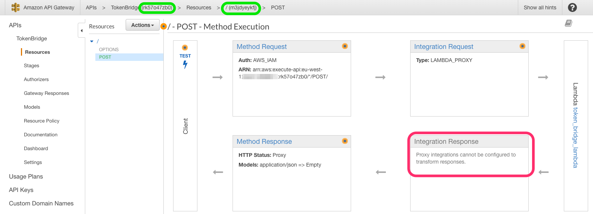
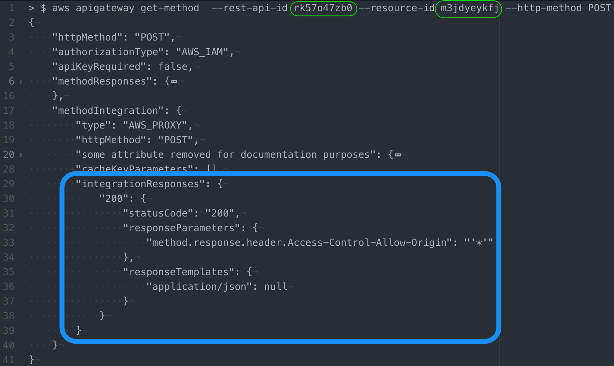

# (Terraforming) AWS management using your Google account
## TL;DR
This Terraform plan will provide you with access to your AWS organisation, using your Google credentials by browsing to (resulting) url; e.g. `http://signin.example.com`

Jump to [Getting started](#getting_started) for instructions.
## Intro
Single Sign On (SSO) is very convenient for users and (security) administrators, and used more commonly. Having a closer look at the underlying technology or ways of configuring SSO can be very interesting. Perhaps equally interesting (for me :wink:), is automating such a setup, using Terraform in this case.

A very nice hands-on (click-on) walkthrough can be found at [the following website](https://dzone.com/articles/google-authentication-for-your-aws-management-cons) where [Oresztesz Margaritisz](https://dzone.com/users/2712582/oresztesz-margaritisz.html) describes how such an integration between AWS and a regular Google account can be achieved. This setup gives a nice insight into setting up SSO in general, as well as the varies AWS components.

While creating the setup yourself is a nice learning experience, for me it was also a nice experience to create a Terraform plan for the respective components:
- S3
- STS
- Lambda
- IAM
- API Gateway
- Route53 (optionally)

Optionally using a hosted zone in Route53 was a small addition of mine which actually simplifies automation and usage a bit. If you don't have access to a hosted zone, the setup will still work.


To just ["get started"](#getting_started), skip down to the [respective section below](#getting_started). Perhaps read the [note on security](#security) first.

## Terraforming
Creating the resources from scratch not only helped in getting more experience with Terraform, it also provided more insight into the respective components. Here I want to share some of these insights.

### Route53 alias to S3 static website hosting url
The idea of using an Alias record in Route53 is to provide a single and fixed (and nicer) url for access to the authentication site, e.g. `signin.example.com`, instead of the S3 static website hosting endpoint such as `google-authenticater-v31haeyr.s3-website-eu-west-1.amazonaws.com`. In case you are wondering, the 6 random characters are there to ensure a bucket is (attempted to be) created which has a unique name.

Setup of such a record seemed simple enough, yet proved difficult or even impossible, even using the management console.

This was solved by RTFM, but in my defence, I'm not the only one who overlooked this in the documentation;
[The name of the record must match the name of your Amazon S3 bucket. For example, if the name of your Amazon S3 bucket is acme.example.com, the name of this record must also be acme.example.com.](https://docs.aws.amazon.com/Route53/latest/DeveloperGuide/resource-record-sets-values-alias.html#rrsets-values-alias-alias-target)

Or as I would say (the same), if you want an `Alias` record of `signin.example.com`  pointing to your bucket, the bucket must be named `signin.example.com` as well (to be clear, resulting in an S3 hosting endpoint of `signin.example.com.s3-website-eu-west-1.amazonaws.com`).

This triggered a thought that when considering that [Bucket names must be unique across all existing bucket names in Amazon S3](https://docs.aws.amazon.com/AmazonS3/latest/dev/BucketRestrictions.html#bucketnamingrules), it could be quit disappointing if you wanted to setup a (static) website in S3 and someone else already claimed *your* company name.

For example, bucket names of `www.google.com` and `www.amazonaws.com` have already been taken by someone :wink:.

### API Gateway
The API gateway took most of my time fitting into Terraform. When creating the plans, I used the following strategies and sources:

Perhaps obvious, but [Terraform documentation](https://www.terraform.io/docs/) is in decent state and provides good examples. Google search provides results from sites like StackOverflow and Github issues, pull requests, where people leave *workarounds* and such.
- [Amazon CloudFormer](https://docs.aws.amazon.com/AWSCloudFormation/latest/UserGuide/cfn-using-cloudformer.html) sounded promising as it can create CloudFormation templates from existing resources. Unfortunately it doesn't support the API Gateway.
- [AWS apigateway CLI](https://docs.aws.amazon.com/cli/latest/reference/apigateway/); after creating the desired configuration using the Management console, using the CLI revealed more information which was required for filling in the Terraform resources.

#### POST Method
For example, when looking at the `POST` method, the management console displays:

From the management console the *Integration Response* is greyed-out. Suggesting editing is not possible or perhaps it's not even present.
When trying to publish a method without the *Integration Response* you will see it's required.
When looking from the CLI, it provides real useful information. (Using the identifiers displayed at the top of the management console, highlighted in green)


The listing from the CLI provides two important pieces of information. The first is that the *Integration Response* is NOT empty. Perhaps it's not allowed to change, but there you can see what information is required to build the Terraform resource.

#### Dependency
The second informational piece from the CLI output is the dependency.
From the management console it seems these (Integration-)Method request and response objects exist independently, or possibly need to exist in the (reverse) execution order. Without explicit dependencies the plan would only succeed after 2 runs.

Terraform evaluates resource references in an attempt to guess the order of creation. But, for example, since all resources of a specific API gateway reference the *main*  `aws_api_gateway_rest_api`, Terraform can not always determine the correct order.

Contrary to the management console, the output from the CLI displays the dependency chain very clearly. Configuring this dependency explicitly on the Terraform resources resulted in requiring only a single execution of the plan.

#### Lack of API deployments
When methods have been created of updated, changes need to be published using a *deployment* before they are actually available via the API endpoint.

Due to an [issue in the Terraform Provider for AWS  ](https://github.com/terraform-providers/terraform-provider-aws/issues/162) changes to dependent resources in an API are NOT properly propagated to trigger the deployment resource. So resources would be changed, but the deployment would not be executed and the API would not show the respective changes.

Perhaps this is not a problem when using this plan just once, but it eventually made it clear to me why certain changes had no effect when I was building and troubleshooting this plan, and trying out different settings (changes) :grimacing:.

### Terraforming *tricks*
During the build up of this plan, some *tricks* were applied. Possibly you should not *try this at home*, or could be used temporary measure.
For example one of these tricks is generating/changing the `index.html` file. This should probably be left to code deployments tools or even configuration management. Then again, acceptable for this example.

#### Forcefully trigger API deployments
If any of the resources change which make up the API gateway, a (re-) deployment should take place. Also if new resources are specified, at creation but also at later change, a deployment needs to take place.

This can be forced by specifying a dependency on all of the resources. This would generate a very lengthy `depends_on`.

Instead, the following trick also makes sure that any change or addition (and changes on those new resources) will always trigger a deployment
```
resource "aws_api_gateway_deployment" "token_bridge_api_deployment" {
  depends_on          = [
    "aws_api_gateway_integration_response.gateway_post_response",
    "aws_api_gateway_integration_response.gateway_option_response",
  ]
  rest_api_id         = "${aws_api_gateway_rest_api.token_bridge_api.id}"
  stage_name          = "prod"
  # https://github.com/terraform-providers/terraform-provider-aws/issues/162
  stage_description   = "${md5(file("aws_apigateway.tf"))}"
}
```
For this project all API Gateway resources are defined in the file `aws_apigateway.tf`. The description of the Deployment resource is filled with the MD5 hash of that file. Thereby any change to the file, thereby any resource defined in that file, will trigger a deployment.

This is a *shortcut* for forcing depending on all (relevant) resources. Perhaps you should investigate which resource does and which doesn't trigger a deployment, but acceptable for this example :wink:.

#### Optional resources
The usage of the hosted domain in Route53 has been made optional. This is dependent on the (environment) variable `AUTHENTICATION_DOMAIN`;
```
resource "aws_route53_record" "signin" {
  count   = "${var.AUTHENTICATION_DOMAIN == "" ? 0 : 1}"
  zone_id = "${data.aws_route53_zone.selected.zone_id}"
```
If the variable is *empty*, the resource count will be set to `0`, effectively NOT creating the resource. This solution seems widely used.

A (dependent) problem is that this resource is dependent on a data source (`data.aws_route53_zone.selected.zone_id`); if no domain is specified, the data source, using the same (environment) variable, will try to fetch (Route53 hosted domain) information using an empty string, and breaks the Terraform run.

The Terraform [documentation on data sources](https://www.terraform.io/docs/configuration/data-sources.html#meta-parameters) specifies: "As data sources are essentially a read only subset of resources they also support the same meta-parameters of resources...".

This means that the `count` parameter is available on data sources as well!
```
data "aws_route53_zone" "selected" {
  count = "${var.AUTHENTICATION_DOMAIN == "" ? 0 : 1}"
  name  = "${var.AUTHENTICATION_DOMAIN}"
}
```
Not sure what it would mean if setting count to something larger than 1, but setting it to zero will make terraform skip trying to get a hosted zone specified by an empty string :grin:.

## Closing note
Building this setup using Terraform was made possible by retrieving information from documentation, *the community* and CLI. By creating this article I hope it helps other people like me trying to familiarise themselves with AWS and different ways of automation, being Terraform in this case.


If not already done so, head over to the to [Getting started](#getting_started) section of the repository, and grant your Google account access to your AWS account.


## <a name="getting_started"></a>Getting started
To (finally) get started with this plan and implement this with your personal (free tier) AWS account, follow these instructions:

1. Clone [this repository](https://github.com/bheuvel/aws-google-signin.git). As it references another repository as submodule, clone using `git clone --recursive`.
1. Export (environment) variables
   - *Export* your AWS API keys and prefered default region (`AWS_ACCESS_KEY_ID  AWS_SECRET_ACCESS_KEY AWS_DEFAULT_REGION`)
   - If you happen to have a domain in Route53, just *export* that domain using `TF_VAR_AUTHENTICATION_DOMAIN`. For example when using a domain of `example.com`, it will generated a record/uri of `signin.example.com`.
1. Let Terraform apply the plan, and note the `authentication_uri` in the output
1. [Create/Configure Google account](#google_setup) oAuth2 using `authentication_uri`
1. Let Terraform apply the plan, and note the authentication_uri in the output
1. Browse to http://`authentication_uri` in the output
   - Hit the Google signin button
1. AWS Management console is automatically loaded


### Why two passes of Terraform

Due to web security minded restrictions such as [Same-origin policy](https://en.wikipedia.org/wiki/Same-origin_policy) and  [CORS](https://en.wikipedia.org/wiki/Cross-origin_resource_sharing) , we need to configure *Google* (account) to allow java script to contact Google from our authentication site (S3 bucket). If we have not configured a Route53 domain, we will access the site by using the S3 bucket url. But the url of the bucket is not available until we run Terraform.
So the first pass is meant to see what the S3 bucket url will be, but will not result in a fully working setup untill we create the Google credentials and provide that to Terraform. The second pass will configure the Google IDs in the page and policies.

### <a name="google_setup"></a>Google Setup
In this Google setup we need to create an Google oAuth client id, and we need to retrieve the numeric id of the Google account itself.
- Sign into Google (e.g. Gmail)
- Go to the [Google developers console](https://console.developers.google.com/)
  - If this is your first access, you need to create a *project* first. Just follow the directions found on that page, as it will be mentioned with everything you try to do. It's basically just providing a name for this project.
  - Go to Credentials -> oAuth consent screen
    - Fill in the *Application name*, and put the `authentication_uri` (output from Terraform) into *Authorized domans* (and hit Enter!), and press save. Be sure the *Authorized domains* was actually saved!
  - Go to Credentials -> Credentials, and create credentials of type *oAuth client ID*.
    - Application type: Web Application
    - Authorized JavaScript origins: "http://`authentication_uri`" (output from Terraform) (hit Enter before clicking save!)
  - Make a note of the "*client_ID*" in the pop-up.
  - **Make sure the uri is actually saved** in the *Authorized domains* and *Authorized JavaScript origins*. The interface seems a bit quirky with actually saving this.
- Go to [https://plus.google.com/me](https://plus.google.com/me). This may result in a "404", but note the resulting url which should look something like "https://plus.google.com/112233445566778899001". This is the numeric ID of your Google account.
   - Make a note of this *Google_ID*.
- Export these Google ID's into the following environment variables for Terraform to use (or edit `variables.tf`):
   - TF_VAR_GOOGLE_CLIENT_ID=*client_ID*
   - TF_VAR_GOOGLE_ID=*Google_ID*

### Troubleshooting
If this doesn't work, you have a nice opportunity too learn :wink:.
For me it mostly had to do with the uri not being saved in the Google config. After failing on this and correcting, you need to clear the browser cache before it will work! When using Chrome this is easily done when you have the "developer tools" activated. When using the "developer tools", looking at the "console" messages will provide you with information about the steps which succeed.

## <a name="security"></a>Note on security

To limit access to the created website (S3 bucket), be sure to look in the `aws_s3.tf` file for the `resource "aws_s3_bucket" "google_authenticater_bucket_site"` where in the policy an access *limitation* is in place:
```
"Condition": {
  "IpAddress": {
    "aws:SourceIp": "0.0.0.0/0"
  }
}
```
Just enter your (public) ip there; e.g. `"192.0.2.156/32"`
